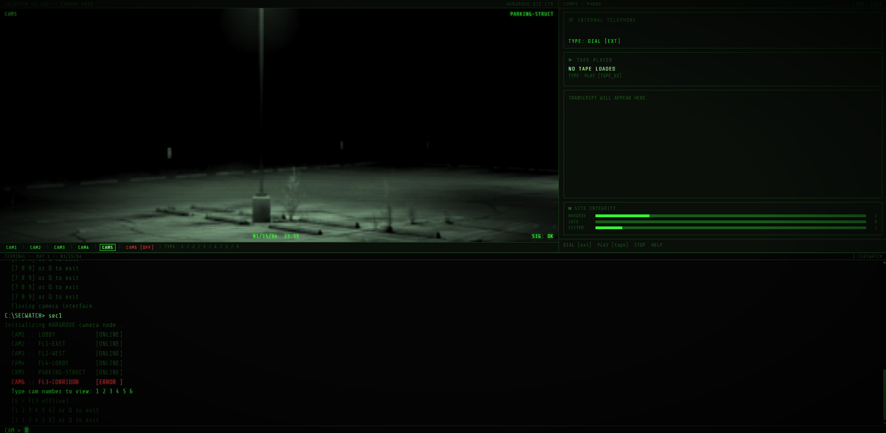
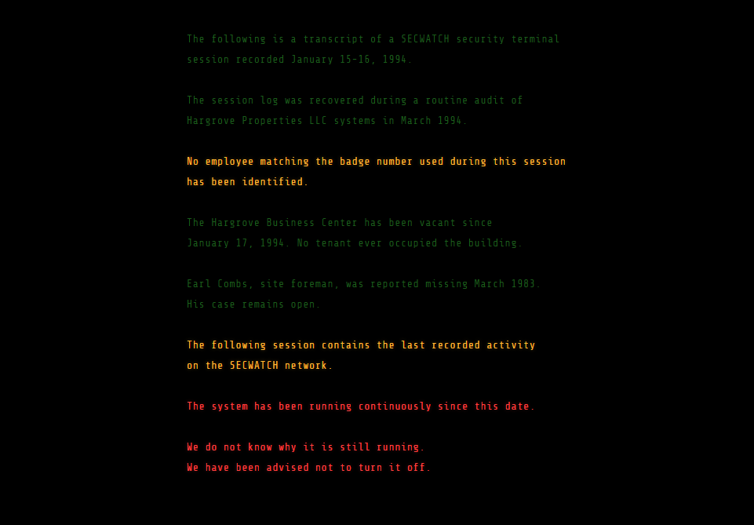

<h2>'Text Command' based game. Zork-like with a HUD.</h2>

<h3>HTML code for Day1 and Day2. Is missing some media.</h3>

<line></line>

  The goal is really to build and have fun doing it. Building the HTML/CSS/JS version seems to be working pretty good. Focusing later on GoDot, a bit stronger.

  Please feel free to look at <i>note.!</i> in the root.
  Leave a note within <i>note.!</i> and commit so I can learn <b>git</b>.
  Of course any art/images to use is welcome, please if you have some upload them!

<h3>Live running version.</h3>
<h4>https://underthewaterfire.com/sec/</h4>

   That site is the newest code. Here are some screenshots and if you want to make MEDIA please do. Look in <i>/md/</i> for the production bible.  

 

Enjoy. Tell me whatever!
