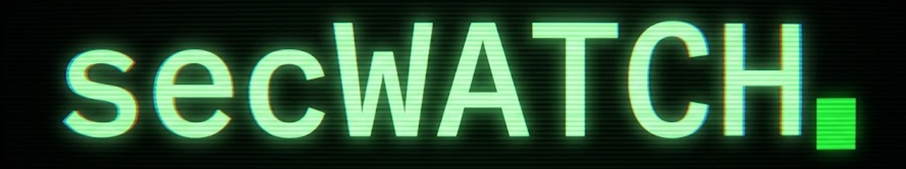

# SECWATCH

A text-command horror game (Zork-like, with a HUD) set in Letcher County, KY, 1994.
Between the days, **The Night Shift** runs: a lane deckbuilder where everything you
dug up during the day becomes your deck.

**Play:** start at `index.html` (Day 1). Everything runs as static files: GitHub
Pages, any web host, or `python3 -m http.server` in this folder. Double-clicking
works too, but the adaptive music (`JAMengine`) needs a server to load.

Live (older build): https://underthewaterfire.com/sec/

## The flow

| Page | What it is |
|---|---|
| `index.html` | **Day 1**: the night shift at the Hargrove Business Center. Starts a fresh run. |
| `day2.html` | **Day 2**: the morning after. Pellegrino calls. |
| `dream.html?night=1` | **Night 1**: FIRST CONTACT |
| `day3.html` | **Day 3**: county records, microfiche, the printer |
| `day4.html` | **Day 4**: Ricky Meade's house |
| `dream.html?night=2` | **Night 2**: THE CORRIDOR |
| `day5.html` | **Day 5**: underground. The boundary. Y/N. |
| `dream.html?night=3` | **Night 3**: THE BOUNDARY |
| `day6.html` → `day7.html` | The Hargrove house, then 1983 |
| `day8.html`, `day9.html` | Post-game, for players who don't leave |

## The Night Shift (card game)

Built on the Nightmare Wood card game (its look and lane engine) and folded together
with the earlier SECWATCH card prototypes. Files you `type`, tapes you `play`
and extensions you `dial` during the day become cards at night. The same digging
raises the threat bars, and the bars make the nightmares stronger.

Full rules, sources, and how to add cards, Terrors, and nights:
**[DESIGN_NIGHTSHIFT.md](DESIGN_NIGHTSHIFT.md)**. All content is in `js/dreamData.js`.

## Layout

```
index.html, day2-9.html     the days
dream.html                  the Night Shift
js/swState.js               shared save (one save, syncs the old sw_* keys)
js/SECengine.js             Day 1 engine      js/Day2-4engine.js   Days 2-4
js/dreamData.js             Night Shift cards / Terrors / nights
js/dreamEngine.js           Night Shift rules
js/JAMengine.js             adaptive music + SFX (audio/jam/)
css/                        styles (dream.css = Night Shift)
img/  audio/                media
videos/                     optional: night_1.mp4 ... plays when you wake
secWatch_story_and_lore.md  the full story, Days 1-10 (spoilers)
md/                         production bible + shot lists
conv/                       ffmpeg converters for camera footage

prototypes (kept for reference):
  remco.html  rem.html  nightmare.html  nightmares.html  _nightmares.html  day3_proto copy.html
```

## Notes

Please look at `note.!` in the root. Leave a note in it and commit, so I can learn git.
Art, images, and voice work are always welcome.

Enjoy. Tell me whatever!
