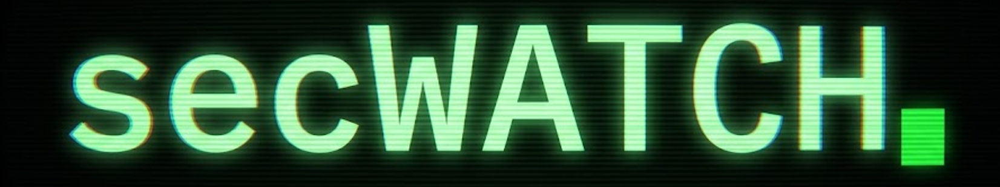

# SECWATCH

A text-command horror game (Zork-like, with a HUD) set in Letcher County, KY, 1994.
Between the days, **The Night Shift** runs: a lane deckbuilder where everything you
dug up during the day becomes your deck. Before all of it, in 1962, there was
**JOSEPH No. 1**: a Wolfenstein-style coal mine that ends in the roots.

**Play:** start at `index.html`, the SECWATCH terminal. Log in with any badge, or a
badge from the registry to jump straight to a day (`0001`–`0010`, nights `0101`–`0103`,
the mine `1962`). See [docs/DASHBOARD.md](docs/DASHBOARD.md).

**Windows:** double-click `SECWATCH_PLAY.bat` to play or `SECWATCH_CONTROL.bat` for the
level and story editor (needs Python for the little local server). Everything else
runs as static files: GitHub Pages, any web host, or `python3 -m http.server` in this
folder. Double-clicking an HTML file works for the days, but the mine levels, your
sprite sheets and the adaptive music (`JAMengine`) need a server.

**Docs:** [docs/README.md](docs/README.md). New session? Read [docs/HANDOFF.md](docs/HANDOFF.md).

Live (older build): https://underthewaterfire.com/sec/

## The flow

| Page | What it is |
|---|---|
| `index.html` | **The SECWATCH terminal**: badge login, mine maps, shift log, site integrity. |
| `mine.html` | **1962, JOSEPH No. 1**: the prequel. E1M1 THE SHIFT, E1M2 THE EAST HEADING. |
| `day1.html` | **Day 1**: the night shift at the Hargrove Business Center. Starts a fresh run. |
| `day2.html` | **Day 2**: the morning after. Pellegrino calls. |
| `dream.html?night=1` | **Night 1**: FIRST CONTACT |
| `day3.html` | **Day 3**: county records, microfiche, the printer |
| `day4.html` | **Day 4**: Ricky Meade's house |
| `dream.html?night=2` | **Night 2**: THE CORRIDOR |
| `day5.html` | **Day 5**: underground. The boundary. Y/N. |
| `dream.html?night=3` | **Night 3**: THE BOUNDARY |
| `day6.html` → `day7.html` | The Hargrove house, then 1983 |
| `day8.html`, `day9.html` | Post-game, for players who don't leave |

## The Night Shift (card game)

Built on the Nightmare Wood card game (its look and lane engine) and folded together
with the earlier SECWATCH card prototypes. Files you `type`, tapes you `play`
and extensions you `dial` during the day become cards at night. The same digging
raises the threat bars, and the bars make the nightmares stronger.

Full rules, sources, and how to add cards, Terrors, and nights:
**[DESIGN_NIGHTSHIFT.md](DESIGN_NIGHTSHIFT.md)**. All content is in `js/dreamData.js`.

## JOSEPH No. 1 (the 1962 mine)

A Wolfenstein-style raycaster in the Joseph brothers' drift mine on the Fire Clay seam.
Cut, drill, check your gas, shoot, load, dump it on the belt, and rock dust as you go. Then,
on Saturday, the belt stops at 2:19 and four men are somewhere in the east heading.
Engine: [docs/MINE_ENGINE.md](docs/MINE_ENGINE.md). Research and premise:
[PREQUEL_1962_JOSEPH_NO1.md](PREQUEL_1962_JOSEPH_NO1.md).

## SECWATCH Control (level + story editor)

`control.html` (or `SECWATCH_CONTROL.bat`) edits the mine levels like an old WAD editor:
paint tiles and rock dust, place people and machines, draw rule zones, and write the
story as WHEN / IF / DO beats. Playtest in one click. Saves plain JSON into `levels/`.
[docs/EDITOR.md](docs/EDITOR.md) · format: [docs/LEVEL_FORMAT.md](docs/LEVEL_FORMAT.md)

## Art

- **Mine sprite sheets:** grid templates in `art/mine/templates/`, built-in art on the same
  grid in `art/mine/reference/`. Paint, save as `img/mine/<sheet>.png`, check it in
  `art/mine_sheets.html`.
- **Day images:** every image slot for every day, with a labelled outline frame at
  the right size, in `art/days/` and `art/day_outlines.html`.

[docs/ART_PIPELINE.md](docs/ART_PIPELINE.md)

## Layout

```
index.html                  the SECWATCH terminal (dashboard, badge login)
day1.html, day2-10.html     the days
dream.html                  the Night Shift
mine.html                   JOSEPH No. 1, the 1962 mine
control.html                SECWATCH Control: level + story editor
levels/                     mine levels (JSON "WADs") + index.json
art/                        sprite sheet templates, day image outlines
docs/                       how everything works (start: docs/HANDOFF.md)
tools/                      smoke test, level generator
SECWATCH_PLAY.bat           Windows: serve + play
SECWATCH_CONTROL.bat        Windows: serve + open the editor
js/swState.js               shared save (one save, syncs the old sw_* keys)
js/badges.js                badge registry (badge -> page)
js/mineEngine.js            mine raycaster    js/mineLevel.js   level format
js/mineSheets.js            sheet grid layout js/mineArt.js     built-in mine art
js/control.js               the editor        js/artManifest.js every image slot per day
js/SECengine.js             Day 1 engine      js/Day2-4engine.js   Days 2-4
js/dreamData.js             Night Shift cards / Terrors / nights
js/dreamEngine.js           Night Shift rules
js/JAMengine.js             adaptive music + SFX (audio/jam/)
css/                        styles (dream.css = Night Shift)
img/  audio/                media
videos/                     optional: night_1.mp4 ... plays when you wake
secWatch_story_and_lore.md  the full story, Days 1-10 (spoilers)
PREQUEL_1962_JOSEPH_NO1.md  1962 prequel: Joseph No. 1 drift, mining research
md/                         production bible + shot lists
conv/                       ffmpeg converters for camera footage

prototypes (kept for reference):
  remco.html  rem.html  nightmare.html  nightmares.html  _nightmares.html  day3_proto copy.html
```

## Notes

Please look at `note.!` in the root. Leave a note in it and commit, so I can learn git.
Art, images, and voice work are always welcome.

Enjoy. Tell me whatever!
